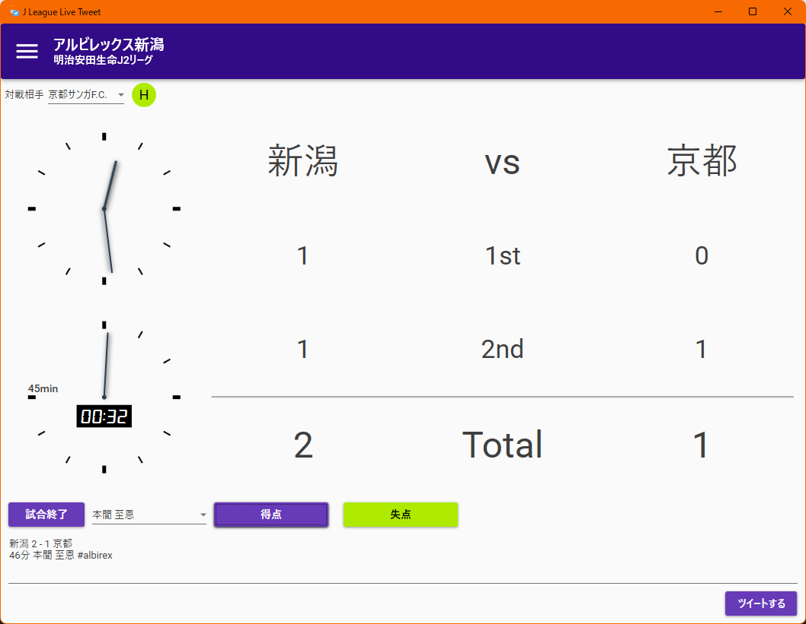

# JLeague Live Tweet



## Description

DAZNでJリーグのライブ中継を見ながら戦況をリアルタイムでツイートするためだけのアプリケーションです。

アプリケーションを使われる方は [For Application Users](#for-application-users) をお読みください。

それ以外は開発者向けの記載です。

## Requirement

- Windows 11 Pro 20H1+
- .NET Framework 4.8
- Visual Studio 2019
- Google Chrome 93.0.4577+

## Usage

Visual Studio 2019でビルドして実行します。

## Install

このリポジトリをフォークしてクローンします。

```
$ git clone git@github.com:yourname/JLeagueLiveTweet.git
```

## For Application Users

本アプリケーションはWindows専用です。他のOSでは利用できません。

また動作には **Google Chrome 93** 以上が必要です。

[Releases](https://github.com/step63r/JLeagueLiveTweet/releases/latest) から最新のインストーラをダウンロードしてインストールしてください。

初回起動時、アプリケーション左上のメニューボタンから以下の設定を行ってください。

1. 「設定」→「マイクラブ」で応援するクラブを選択
2. 「設定」→「Twitterアカウント」でTwitterアカウントを連携
3. 「選手情報」でマイクラブに選択したクラブの選手情報を取得

クラブの所属ディビジョンやハッシュタグが異なる場合、「クラブ情報」ページから情報を変更することができます。クラブの新規追加と削除には今のところ対応していません。

実況ツイートは「スコアボード」ページから行います。

1. 対戦相手を選択
2. ホーム (H) またはアウェイ (A) をトグルで選択
3. キックオフと同時に「試合開始」ボタンを押下
4. 得点したときは「前半終了」ボタン隣のドロップダウンリストから得点選手を選択し「得点」ボタンを押下
5. 失点したときは「失点」ボタンを押下
6. 前半終了と同時に「前半終了」ボタンを押下
7. 後半についても同様

試合開始、前半終了、後半開始、試合終了、得点、失点の各タイミングでページ下部に試合状況が表示されます。「ツイートする」ボタンを押下すると連携しているアカウントでツイートできます。ツイート前に内容を変更することも可能です。


## Contribution

1. このリポジトリをフォークします
2. 修正ブランチを切ります
3. 変更をコミットします
4. ブランチをプッシュします
5. プルリクエストを作成します

## License

MIT License

## Author

[minato](https://blog.minatoproject.com/)

## Acknowledgements

### Applicaion Icon

#### soccer.png

Icons made by itim2101 from [www.flaticon.com](https://www.flaticon.com/)

#### twitter.png

Icons made by [Pixel Buddha](mailto:info@pixelbuddha.net) from [www.flaticon.com](https://www.flaticon.com/)
